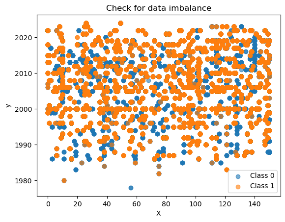
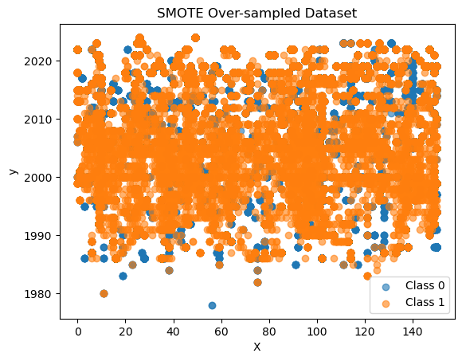
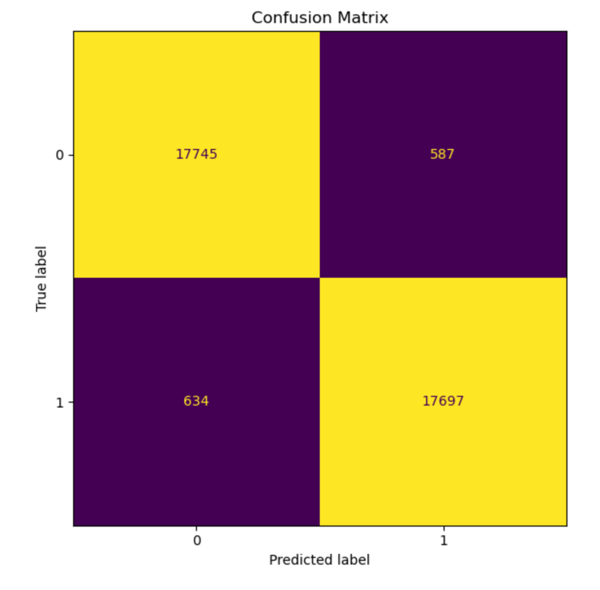

# 🌍 Global Immunization Gap Prediction

## 📌 Overview
This project uses machine learning to identify regions at risk of **low vaccination coverage**, helping organizations like WHO and UNICEF make data-driven decisions.

---

## 🚨 Problem
Low immunization rates can lead to disease outbreaks.  
Goal: Predict **high-risk regions** to improve intervention strategies.

---

## 📊 Dataset
- Source: UNICEF Immunization Data  
- Target: `low_coverage` (1 if coverage < 50%)

---

## ⚙️ Workflow
- Data cleaning & preprocessing  
- Feature engineering  
- Handling missing values  
- Encoding categorical variables  
- Class imbalance handling (SMOTE)  
- Model training + evaluation (MLflow)

---

## 📉 Data Imbalance



---

## ⚖️ SMOTE Balanced Data



---

## 📊 Confusion Matrix (XGBoost)



---

## 🤖 Models Used
- Logistic Regression  
- Random Forest  
- Decision Tree  
- KNN  
- XGBoost  
- MLP Classifier  

---

## 🏆 Best Model: XGBoost
- F1 Score: **0.9667**
- Best balance of precision & recall
- Strong performance on imbalanced data

---

## 📈 Results

| Model              | F1 Score |
|--------------------|---------|
| Logistic Regression | 0.9127  |
| Random Forest       | 0.9451  |
| Decision Tree       | 0.9387  |
| KNN                 | 0.8675  |
| **XGBoost**         | **0.9667** |
| MLP                 | 0.8409  |

---

## 🚀 How to Run

```bash
git clone https://github.com/camelliale1912/global-immunization-gap-prediction.git
cd global-immunization-gap-prediction
pip install -r requirements.txt
jupyter notebook
